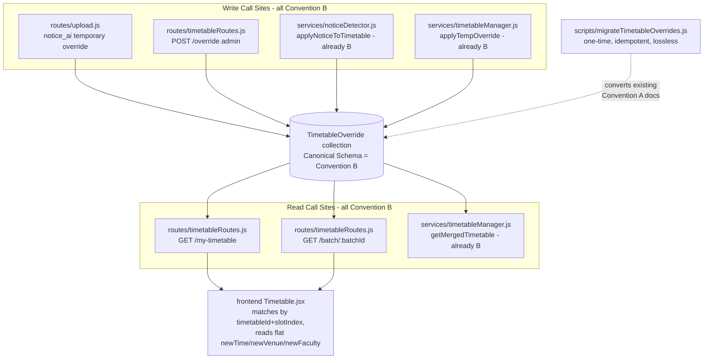

# Design Document

## Overview

This feature unifies the `TimetableOverride` model and all of its call sites onto a single
field convention — **Convention B** (the Canonical Schema) — as resolved in the requirements.
Today the model declares **Convention A** (`originalSlotId`, `date` string, `newDetails`,
`adminName`, `status`) with `originalSlotId` and `date` marked `required`, while two of the
four write call sites (`services/noticeDetector.js`, `services/timetableManager.js`) and the
entire test suite use **Convention B** (`timetableId`, `slotIndex`, `effectiveDate` Date,
flat `newTime`/`newVenue`/`newFaculty`/`newDay`, `createdBy`, `source`, `flaggedForReview`).
Every Convention B write therefore fails validation, and the read paths are split so the two
halves of the timetable feature cannot observe each other's overrides.

The work has four parts:

1. **Rewrite the schema** (`backend/models/TimetableOverride.js`) to declare only Convention B,
   choosing `required` flags carefully so that no write call site is rejected for a field it
   cannot supply.
2. **Migrate the two Convention A call sites** (`routes/timetableRoutes.js` and `routes/upload.js`)
   to produce and read Convention B documents, preserving existing authorization and audit-log
   (`TimetableLog`) writes.
3. **Provide a one-time, idempotent, lossless data migration script**
   (`backend/scripts/migrateTimetableOverrides.js`) that converts existing Convention A documents
   already stored in the deployed database into Convention B.
4. **Update the one frontend consumer** (`frontend/src/pages/Timetable.jsx`) that reads
   `override.originalSlotId` and `override.newDetails`, because the override object shape returned
   by the GET endpoints changes.

The existing Convention B logic in `noticeDetector.js` and `timetableManager.js`, and the
`getMergedTimetable` read pattern, are treated as the reference implementation. They are not
rewritten; the rest of the system is brought into alignment with them.

### Research / Code Findings

The following observations from the real code drive the design:

- **`models/Timetable.js`** — A `Timetable` document is keyed by `batchId` + `dayOfWeek`
  (unique compound index) and holds a `slots` array. Each slot is a subdocument with a
  Mongoose-assigned `_id`, plus `time`, `courseCode`, `courseName`, `venue`, `faculty`.
  A slot is therefore addressable two ways: by its subdocument `_id` (Convention A
  `originalSlotId`) or by `timetableId` + array index (Convention B `slotIndex`). The migration
  must translate the former into the latter by scanning `Timetable.slots`.
- **`services/timetableManager.js` `getMergedTimetable`** is the canonical read: it computes
  `startOfDay`/`endOfDay` from the target date and queries
  `{ batchId: { $in }, effectiveDate: { $gte: startOfDay, $lte: endOfDay } }`, then matches
  overrides to slots by `timetableId` + `slotIndex`. The two route reads will adopt this exact
  pattern.
- **`services/timetableManager.js` `applyTempOverride`** writes Convention B with
  `createdBy: adminUser._id`, `source` (default `'admin'`), and `flaggedForReview` (default
  `false`). It does **not** always pass `newDay`, `reason`, etc., so those must be optional.
- **`services/noticeDetector.js`** writes Convention B for temporary notices with
  `source: 'notice_ai'`, `createdBy: userId`, `newTime/newVenue/newFaculty` defaulting to `null`,
  and does **not** set `newDay`. For permanent notices it mutates `Timetable` directly and creates
  **no** override (Requirement 6.3). This must remain unchanged.
- **`routes/timetableRoutes.js`** `POST /override` currently reads
  `originalSlotId, date, overrideType, newDetails, reason` from `req.body` and writes Convention A
  with `adminName: req.user.name`. The two GET reads (`/my-timetable`, `/batch/:batchId`) filter
  `{ date: reqDate (string), status: 'active' }`. All three need conversion. `requireAdmin` and the
  `TimetableLog` audit writes must be preserved.
- **`routes/upload.js`** has a `timetable_update` block that, for `change_type === 'temporary'`,
  writes Convention A with `originalSlotId: targetSlot._id`, `date: update.date`,
  `newDetails: update.new_details`, `adminName: 'AI Notice Detector'`, `status: 'pending_review'`.
  The `targetSlot` is located by scanning `Timetable.find({ batchId })` and finding the slot whose
  `courseCode` matches — so the timetable document and slot are already in hand; the slot **index**
  just needs to be captured. The permanent branch, the notification dispatch, and the `TimetableLog`
  writes must be preserved.
- **`frontend/src/pages/Timetable.jsx`** is the only frontend override consumer. It matches
  overrides to slots with `overrides.find(o => o.originalSlotId === slot._id)` and reads
  `override.newDetails?.time/venue/faculty`. Both the matching key and the value fields change
  under Convention B, so this file must be updated (details in "Frontend Consumption").
- **`extractTimetableUpdateFromText`** (in `documentExtractor.js`) yields update objects shaped
  `{ course_code, course_name, date (YYYY-MM-DD), original_time, change_type, override_type,
  new_details: { time, venue, faculty }, reason }`. This is the input to the upload.js override block.

## Architecture

The override subsystem is a thin layer over MongoDB. There are no new components; the change is a
field-convention unification plus a migration utility. The data flow after the change:



All four writers converge on one schema; all three readers use the same
`effectiveDate` Date-range + `timetableId`/`slotIndex` query and matching logic. The migration
script is a one-shot batch job run by an operator against the deployed database.

## Components and Interfaces

### 1. `TimetableOverride` model (`backend/models/TimetableOverride.js`)

Rewritten to declare only Convention B fields (see Data Models). Exports the same
`TimetableOverride` mongoose model so no importer changes its import statement.

### 2. `routes/timetableRoutes.js`

- **`POST /override`** (auth: `requireAdmin(batchId, req.user._id)` — unchanged):
  - Request body changes from `{ batchId, originalSlotId, date, overrideType, newDetails, reason }`
    to `{ batchId, timetableId, slotIndex, effectiveDate, overrideType, newTime, newVenue,
    newFaculty, newDay, reason }`.
  - Creates the override via Convention B fields with `createdBy: req.user._id`, `source: 'admin'`,
    `flaggedForReview: false` (default).
  - `TimetableLog` audit write is preserved (description adjusted to reference `timetableId`/
    `slotIndex`/`effectiveDate`).
  - Returns `{ message, override }` — unchanged response envelope, new override shape.
- **`GET /my-timetable`** and **`GET /batch/:batchId`**:
  - Override query changes from `{ batchId, date: reqDate (string), status: 'active' }` to the
    canonical Date-range query: compute `startOfDay`/`endOfDay` from the requested date and query
    `{ batchId (or $in), effectiveDate: { $gte: startOfDay, $lte: endOfDay } }`.
  - The response continues to return `{ timetables, overrides }`; the `overrides` array now contains
    Convention B documents. (Slot↔override matching by `timetableId` + `slotIndex` happens on the
    frontend, consistent with current behavior where matching happens on the frontend.)

### 3. `routes/upload.js` (`timetable_update` → temporary branch)

- When locating `targetSlot`, also capture `targetTimetable` (the `tt` document) and
  `targetSlotIndex` (the index of the matched slot within `tt.slots`).
- Replace the Convention A `TimetableOverride.create({...})` with Convention B:
  `{ batchId: targetBatchId, timetableId: targetTimetable._id, slotIndex: targetSlotIndex,
  effectiveDate: new Date(update.date), overrideType: update.override_type,
  newTime: update.new_details?.time || null, newVenue: update.new_details?.venue || null,
  newFaculty: update.new_details?.faculty || null, newDay: null, reason: update.reason || '...',
  createdBy: req.user._id, source: 'notice_ai', flaggedForReview: true }`
  (`flaggedForReview: true` preserves the old `status: 'pending_review'` semantics).
- The permanent branch, `Notification.insertMany` dispatch, and both `TimetableLog` writes are
  preserved unchanged.

### 4. `backend/scripts/migrateTimetableOverrides.js`

A standalone Node script (ESM, consistent with the codebase) that connects to MongoDB, scans the
`TimetableOverride` collection for Convention A documents, converts each to Convention B in place,
and is safe to re-run. Interface: run via `node backend/scripts/migrateTimetableOverrides.js`
(reads connection string from the same env/config as the app, e.g. `config/db.js`). It logs a
summary `{ scanned, converted, alreadyB, unresolved }` and exits non-zero only on connection/fatal
errors. Detailed algorithm in "Data Migration".

### 5. `frontend/src/pages/Timetable.jsx`

Updated to consume Convention B overrides (details in "Frontend Consumption").

## Data Models

### Canonical Schema (Convention B) — `TimetableOverride`

```js
const timetableOverrideSchema = new mongoose.Schema(
  {
    batchId:    { type: ObjectId, ref: 'Batch',     required: true },
    timetableId:{ type: ObjectId, ref: 'Timetable', required: true },
    slotIndex:  { type: Number,                     required: true },
    effectiveDate: { type: Date,                    required: true },
    overrideType: {
      type: String,
      enum: ['rescheduled', 'cancelled', 'room_changed', 'faculty_changed'],
      required: true,
    },
    newTime:    { type: String, default: null },
    newVenue:   { type: String, default: null },
    newFaculty: { type: String, default: null },
    newDay:     { type: String, default: null },
    reason:     { type: String, default: '' },
    createdBy:  { type: ObjectId, ref: 'User' },         // NOT required (see rationale)
    source:     { type: String, default: 'admin' },      // 'admin' | 'notice_ai'
    flaggedForReview: { type: Boolean, default: false },

    // Migration-preservation fields (only populated for un-resolvable migrated docs)
    legacyOriginalSlotId: { type: ObjectId, default: undefined },
    migrationUnresolved:  { type: Boolean,  default: undefined },
  },
  { timestamps: true }
);

timetableOverrideSchema.index({ batchId: 1, effectiveDate: 1 });          // Read Call Site filter
timetableOverrideSchema.index({ batchId: 1, timetableId: 1, slotIndex: 1 }); // slot resolution
```

**Required-field rationale (Requirement 1.3 — do not require a field a writer cannot supply):**

| Field            | required? | Reasoning |
|------------------|-----------|-----------|
| `batchId`        | yes       | Supplied by all four writers. |
| `timetableId`    | yes       | Supplied by all four writers (route + upload resolve it from the slot; services already have it). |
| `slotIndex`      | yes       | Supplied by all four writers. `0` is valid, so `required` is safe (do not use truthiness checks elsewhere). |
| `effectiveDate`  | yes       | Supplied by all four writers. |
| `overrideType`   | yes       | Supplied by all four writers; enum retained per Req 1.4/7.1. |
| `newTime/Venue/Faculty/Day` | no (default `null`) | Only the changed field is set; others legitimately absent. |
| `reason`         | no (default `''`) | `applyTempOverride` and the route may omit it. |
| `createdBy`      | **no**    | Migrated Convention A docs have only `adminName` (a string), no user ObjectId. Marking it required would make migrated docs invalid. Live writers all supply it. |
| `source`         | no (default `'admin'`) | Provenance; defaulted. |
| `flaggedForReview` | no (default `false`) | Defaulted. |

**Decisions:**

- **`timestamps: true` is retained.** The current model has it, `getMergedTimetable` does not depend
  on it, and `createdAt`/`updatedAt` are useful for review/audit. Keeping it avoids a needless change.
- **Indexes:** `{ batchId, effectiveDate }` directly backs the Read Call Site filter (Requirement 5.4).
  A second index `{ batchId, timetableId, slotIndex }` is added to support per-slot resolution and the
  migration's slot lookups; it is optional for correctness but improves read/merge performance.
- **`createdBy` is left a plain `ObjectId ref User` and is not required**, so migrated documents whose
  actor was only `adminName` remain valid. The migration preserves `adminName` text into `reason`
  (prefixed) rather than fabricating a fake user id (see Data Migration).
- **Convention A fields are dropped** from the schema (`originalSlotId`, `date`, `newDetails`,
  `adminName`, `status`). Two optional preservation fields (`legacyOriginalSlotId`,
  `migrationUnresolved`) exist solely so the migration never silently drops an un-resolvable document
  (Requirement 7.5/7.6). They are `undefined` by default and absent on normal documents.

### Data Migration (`scripts/migrateTimetableOverrides.js`)

Algorithm (idempotent + lossless, Requirement 7.3–7.6):

1. Connect to MongoDB. Load all `TimetableOverride` documents using `.lean()` over the raw collection
   (so Convention A fields, which are no longer in the schema, are still readable).
2. For each document, **detect convention**:
   - If it already has `effectiveDate` (a `Date`) and `timetableId` → **already Convention B**, skip
     (this is what makes the script safe to re-run; converted docs are not touched again).
   - Else if it has the Convention A markers (`date` string and/or `originalSlotId`) → convert.
3. **Convert a Convention A document**:
   - `effectiveDate = new Date(\`${date}T00:00:00\`)` (parse the `YYYY-MM-DD` string to a `Date` at
     local start-of-day, matching the Date-range read semantics).
   - `newTime = newDetails?.time || null`, `newVenue = newDetails?.venue || null`,
     `newFaculty = newDetails?.faculty || null`, `newDay = null`.
   - `reason`: preserve, and if `adminName` was present, prefix it:
     `reason = \`[migrated from adminName: ${adminName}] ${oldReason || ''}\`.trim()`
     (maps the actor representation onto the canonical schema without fabricating a `createdBy`).
   - `source = 'admin'` (Convention A docs predate the provenance field; default to admin),
     unless `adminName` indicates the AI detector (`/AI/i`), in which case `source = 'notice_ai'`.
   - `flaggedForReview = (status === 'pending_review')`.
   - **Resolve `originalSlotId` → `timetableId` + `slotIndex`:** load candidate `Timetable`
     documents for `batchId` and search each `slots` array for a subdocument whose `_id` equals
     `originalSlotId`; the matching timetable's `_id` becomes `timetableId` and the array position
     becomes `slotIndex`.
     - **Resolved:** set `timetableId` + `slotIndex`, unset Convention A fields.
     - **Unresolved** (slot `_id` no longer exists): set `migrationUnresolved = true`,
       `legacyOriginalSlotId = originalSlotId`, and leave `timetableId`/`slotIndex` unset. The
       document is updated in place (Convention A fields removed, Convention B fields added where
       known) but explicitly retained — never deleted (Requirement 7.6).
4. Persist each conversion with a raw `updateOne({ _id }, { $set: {...}, $unset: {...} })`.
5. Log `{ scanned, converted, alreadyB, unresolved }`.

Re-running the script re-scans, finds every document is already Convention B (step 2), and converts
nothing — the idempotence guarantee.

> **Note on `effectiveDate` for unresolved docs:** even when the slot cannot be resolved, the date,
> override type, and changed values are still converted, so the document remains partially queryable
> and its data is preserved.

## Frontend Consumption

`frontend/src/pages/Timetable.jsx` is the only frontend override consumer (verified by searching the
frontend tree). The GET response envelope is unchanged (`res.data.data.timetables` and
`res.data.data.overrides`), but the **shape of each override object changes**, so this file must be
updated:

- **Slot matching key changes.** Current:
  `overrides.find(o => o.originalSlotId === slot._id)`. Convention B has no `originalSlotId`.
  New matching must use `timetableId` + `slotIndex`. The component renders slots per day from
  `todayTimetable` (which has `_id` = the timetable id) and maps with an index, so it should match:
  `overrides.find(o => o.timetableId === todayTimetable._id && o.slotIndex === originalIndex)`.
  Because the list is sorted before rendering, the **original (pre-sort) slot index** must be used,
  not the post-sort `idx`. (The component currently sorts then uses `idx` only as a React key, so the
  fix is to compute the index from the unsorted `todayTimetable.slots`.)
- **Value fields change.** Replace `override.newDetails?.time/venue/faculty` with the flat
  `override.newTime/newVenue/newFaculty`. The display logic (`displayTime`, `displayVenue`,
  `displayFaculty`) is otherwise unchanged.
- `override.overrideType` and `override.reason` are unchanged and continue to work.

These are the only frontend edits required. (The actual frontend edits are out of scope for the
backend tasks but are documented here so they are not missed during implementation.)

## Correctness Properties

*A property is a characteristic or behavior that should hold true across all valid executions of a
system — essentially, a formal statement about what the system should do. Properties serve as the
bridge between human-readable specifications and machine-verifiable correctness guarantees.*

The acceptance criteria were analyzed (see prework). Many criteria are structural/configuration
facts (one schema exists, enum retained, index present, test-suite outcomes) and are best covered by
smoke/example tests rather than property-based tests. The criteria that express universal,
input-varying behavior — schema validation across all write call sites, date-range read filtering,
and the migration's transformation guarantees — are captured as the properties below. Redundant
criteria were merged during property reflection (1.2≡1.3; 5.1≡5.3; 7.3/7.5/7.6 consolidated;
2.x/4.x left as example tests).

### Property 1: Every write call site's payload is schema-valid

*For any* valid Convention B override payload drawn from the union of the four write call sites'
field subsets — including payloads that omit the optional fields (`reason`, `newDay`, `source`,
`flaggedForReview`, `createdBy`), set `newTime`/`newVenue`/`newFaculty` to `null`, and use
`slotIndex` of `0` — constructing a `TimetableOverride` produces a document that passes schema
validation with no error.

**Validates: Requirements 1.2, 1.3, 4.2, 7.2**

### Property 2: Reads return exactly the overrides for the queried date

*For any* batch and any set of `TimetableOverride` documents with arbitrary `effectiveDate` values
and arbitrary `source` values, querying the Read Call Site filter for a target date (start-of-day to
end-of-day range) returns every override whose `effectiveDate` falls within that day and no override
whose `effectiveDate` falls outside it — irrespective of which write call site created each override.

**Validates: Requirements 5.1, 5.2, 5.3**

### Property 3: Migration is lossless and resolves or preserves every document

*For any* collection of existing Convention A `TimetableOverride` documents — some whose
`originalSlotId` matches a slot in an existing `Timetable` and some whose `originalSlotId` matches no
slot — running the migration leaves the total document count unchanged, converts every document to
Convention B, sets `timetableId` + `slotIndex` correctly for every resolvable document, and retains
every unresolvable document with its original identifying data preserved
(`legacyOriginalSlotId` set, `migrationUnresolved = true`) rather than dropping it.

**Validates: Requirements 7.3, 7.5, 7.6**

### Property 4: Migration field mapping and defaults are correct

*For any* Convention A document, the migrated Convention B document satisfies: `effectiveDate`
equals the `Date` parsed from the `date` string; `newTime`/`newVenue`/`newFaculty` equal
`newDetails.time`/`newDetails.venue`/`newDetails.faculty` (or `null` when absent);
`flaggedForReview` equals `(status === 'pending_review')`; the original `adminName` text is preserved
on the document; and every canonical field not previously supplied (`source`, `newDay`,
`flaggedForReview`) is defined rather than left undefined.

**Validates: Requirements 7.4, 7.7**

### Property 5: Migration is idempotent

*For any* collection of `TimetableOverride` documents, running the migration twice produces the same
collection state as running it once (a second run converts nothing because every document is already
Convention B).

**Validates: Requirements 7.3**

### Property 6: Permanent notices mutate the master timetable and create no override

*For any* permanent notice (of any `overrideType`, including `cancelled`) that matches a slot in a
generated timetable, processing the notice creates zero `TimetableOverride` documents and mutates the
master `Timetable` accordingly (the slot is removed for `cancelled`, otherwise its changed fields are
updated and `lastPermanentUpdateAt`/`By` are set).

**Validates: Requirements 6.3**

### Property 7: Temporary override leaves the master timetable unchanged

*For any* valid temporary override applied via `applyTempOverride` to a generated timetable slot, the
referenced master `Timetable` document's `slots` remain unchanged after the override is created.

**Validates: Requirements 3.2**

## Error Handling

- **Schema validation errors:** With the corrected required-flags, valid Convention B writes no
  longer throw. Genuinely invalid writes (missing `overrideType`, out-of-enum value, missing
  `batchId`/`timetableId`/`slotIndex`/`effectiveDate`) still throw a Mongoose `ValidationError`;
  route handlers continue to surface these via the existing `fail(res, err.message, 500)` path, and
  service functions return `{ success: false, error: err.message }` as they do today.
- **`applyTempOverride` invalid input:** Existing behavior is preserved — a missing timetable returns
  `{ success: false, error: 'Timetable not found' }` and an out-of-range `slotIndex` returns
  `{ success: false, error: 'Invalid slot index' }` (Requirement 3.3).
- **Route authorization:** `requireAdmin` continues to throw on non-owner/moderator; handlers map the
  thrown message to HTTP 403 (`err.message.includes('Unauthorized')`), and no override is created
  (Requirement 4.3).
- **Upload override mapping:** If no `targetSlot` is found for an update, the existing code skips that
  update (no override created) — preserved. `effectiveDate` is built with `new Date(update.date)`;
  if the extractor already guarantees `YYYY-MM-DD`, this is valid. An invalid date would produce an
  `Invalid Date`; this is consistent with current behavior where the string was stored verbatim, and
  is acceptable because the extractor validates `date` presence/format before emitting updates.
- **Migration robustness:** The migration wraps each document conversion in try/catch, counts and
  logs failures, and continues; it never deletes a document it cannot convert (Requirement 7.6). A
  fatal connection error exits non-zero so an operator notices. Re-running after a partial run is
  safe due to idempotence (Property 5).
- **`slotIndex === 0` correctness:** Because `slotIndex` can legitimately be `0`, all matching and
  resolution logic must use strict index comparison (`o.slotIndex === idx`), never truthiness checks,
  to avoid dropping the first slot's override.

## Testing Strategy

### Dual approach

- **Property-based tests** verify the universal properties above across many generated inputs.
- **Unit / example tests** verify specific scenarios, route behavior, authorization, and audit-log
  writes.
- **Smoke tests** verify structural facts (single schema, enum membership, index presence).

PBT **is** appropriate here: the schema validation, the date-range read filter, and the migration
transformation are pure, input-varying logic with clear "for all inputs" statements. The route
plumbing, authorization, and notification dispatch are example/integration-level and are tested with
concrete cases plus an in-memory MongoDB (`mongodb-memory-server`, already used by the suite).

### Property-based testing setup

- **Library:** `fast-check` (JS/Jest, matching the existing Jest + ESM test setup). Do not implement
  PBT from scratch.
- **Iterations:** each property test runs a minimum of **100** iterations (`fc.assert(..., { numRuns: 100 })`).
- **Backing store:** in-memory MongoDB via `mongodb-memory-server`, reset between runs, so 100+
  iterations stay cheap.
- **Tag format** (comment on each property test):
  `// Feature: timetable-override-schema-unification, Property {n}: {property text}`
- **Generators:**
  - *Override payload generator* (P1): produces Convention B payloads with required fields always
    present (valid `ObjectId`s, `slotIndex >= 0` including `0`, a `Date`, an enum `overrideType`) and
    optional fields randomly present/absent/`null`.
  - *Override-set generator* (P2): a batch id plus N overrides with `effectiveDate` spread across a
    range of days and random `source`; plus a randomly chosen target date.
  - *Convention A corpus generator* (P3–P5): generates a set of timetables with slots (capturing real
    slot `_id`s) and Convention A docs that reference either a real slot `_id` (resolvable) or a
    random unused `ObjectId` (unresolvable), with random `date`, `newDetails`, `status`, `adminName`.
  - *Permanent-notice generator* (P6) and *temp-override generator* (P7): notices/params with random
    type and slot data against a generated timetable.

### Property → test mapping

| Property | Target under test | Notes |
|----------|-------------------|-------|
| P1 | `TimetableOverride` schema `validateSync()` | 100+ payloads, all call-site subsets |
| P2 | Read Call Site filter (`effectiveDate` Date-range query) | exact-match: no false +/- |
| P3 | `migrateTimetableOverrides.js` | count preserved, all converted, unresolved retained |
| P4 | `migrateTimetableOverrides.js` | per-field mapping + defaults |
| P5 | `migrateTimetableOverrides.js` | run twice == run once |
| P6 | `applyNoticeToTimetable` (permanent path) | zero overrides + master mutated |
| P7 | `timetableManager.applyTempOverride` | master `slots` unchanged |

### Unit / example / smoke tests

- Schema smoke: exactly one schema; all Convention B paths present; `overrideType` enum accepts the
  four values and rejects others; `schema.indexes()` contains `{ batchId: 1, effectiveDate: 1 }`
  (Req 1.1, 1.4, 5.4, 7.1).
- `POST /api/timetable/override` handler: authorized admin creates a Convention B override and gets
  `{ message, override }`; a `TimetableLog` entry is written; non-admin gets 403 with zero docs
  created (Req 4.1, 4.3, 6.4).
- `routes/upload.js` temporary branch: with a seeded timetable, an extracted update creates a
  Convention B override (`source: 'notice_ai'`, `flaggedForReview: true`, resolved
  `timetableId`/`slotIndex`), the notification is dispatched, and the `TimetableLog` entry is written
  (Req 4.2, 6.4, 7.2).
- GET `/my-timetable` and `/batch/:batchId`: with overrides on and off the target date, the response
  `overrides` array contains exactly the in-range Convention B docs (example complement to P2).
- Existing `applyNoticeToTimetable.test.js` cases (temporary creates override, permanent updates/
  removes slot, skip cases, case-insensitive match, flaggedForReview passthrough, mixed results) must
  pass unchanged (Req 2.1–2.4, 3.1, 6.1).

### No-regression strategy (Requirement 6.1, 6.2)

- The Convention B services (`noticeDetector.js`, `timetableManager.js`) and their behavior are not
  modified, so `applyNoticeToTimetable.test.js` flips from failing to passing purely via the schema
  fix.
- The other passing suites — `noticeDetector`, `timetableManager`, `courseFilter`,
  `documentRouter`, preservation, and `bugConditionExploration` — exercise code paths that this
  change does not touch (extraction, classification, routing, duplicate checks). The only shared
  surface is the `TimetableOverride` schema; because the new schema is a strict superset-compatible
  Convention B (which those tests already assume), they continue to pass.
- Verification: run the full backend suite (`npm test` in `backend/`, single-run mode) after each
  change and before completion; confirm zero regressions and that the four previously failing
  Override_Test cases pass.
